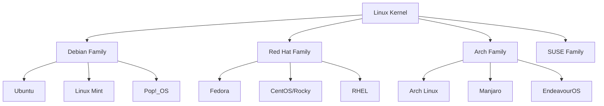

_Conceitos Fundamentais e Distribuições_

---

## 🚀 Introdução ao Linux

**Linux®** é um sistema operacional revolucionário criado por **Linus Torvalds em 1991**. O que começou como um projeto pessoal se tornou uma das maiores forças tecnológicas do mundo moderno.

### 📊 **Por que o Linux é Importante?**

| Característica       | Impacto                                           |
| -------------------- | ------------------------------------------------- |
| 🌍 **Código Aberto** | Desenvolvimento colaborativo mundial              |
| 🔒 **Segurança**     | Menos vulnerabilidades, atualizações rápidas      |
| ⚡ **Performance**    | Usado nos **500 supercomputadores mais potentes** |
| 💰 **Custo**         | Gratuito e sem licenças proprietárias             |
| 🔧 **Versatilidade** | De smartphones a servidores empresariais          |

> 💡 **Fato Impressionante:** O Linux alimenta praticamente toda a internet moderna, de servidores web a dispositivos IoT!

---

## 🖥️ O que é um Sistema Operacional?

Um **sistema operacional (SO)** é o software fundamental que:

### 🎯 **Funções Principais:**

- **Gerencia recursos** de hardware (CPU, memória, disco)
- **Controla sistemas de arquivos** e permissões
- **Executa e coordena** programas e aplicativos
- **Estabelece interface** entre usuário e computador
- **Fornece segurança** e controle de acesso

```
┌─────────────────┐
│    Usuário      │
└─────────────────┘
         │
┌─────────────────┐
│  Aplicativos    │
└─────────────────┘
         │
┌─────────────────┐
│Sistema Operac.  │ ← Linux está aqui!
└─────────────────┘
         │
┌─────────────────┐
│   Hardware      │
└─────────────────┘
```

---

## 🔓 Software Open Source Explicado

### 📖 **Definição**

Software **open source** (código aberto) é um modelo de desenvolvimento **descentralizado e colaborativo** que:

- ✅ **Disponibiliza código-fonte** publicamente
- ✅ **Permite uso gratuito** sem restrições
- ✅ **Autoriza modificações** e melhorias
- ✅ **Incentiva redistribuição** da comunidade

### 🆚 **Open Source vs. Código Fechado**

|🔓 **Open Source**|🔒 **Código Fechado**|
|---|---|
|**Código público**|**Código secreto**|
|**Gratuito**|**Pago (licenças)**|
|**Modificável**|**Não modificável**|
|**Comunidade colabora**|**Empresa controla**|
|**Exemplos:** Linux, Firefox|**Exemplos:** Windows, Photoshop|

### 🌟 **Vantagens do Open Source:**

- 🔍 **Transparência total** - você vê exatamente o que o software faz
- 🚀 **Inovação rápida** - milhares de desenvolvedores contribuem
- 🛡️ **Segurança superior** - bugs são encontrados e corrigidos rapidamente
- 💸 **Custo zero** - sem taxas de licenciamento
- 🎨 **Personalização ilimitada** - adapte às suas necessidades

---

## 🎨 Flavors e Distros: O Universo Linux

O Linux não é um sistema único, mas uma **família de sistemas operacionais** construídos sobre o mesmo kernel. Cada versão é chamada de **distribuição** ou **distro**.

### 🔍 **Conceito Básico:**

- **Kernel Linux** = motor do carro
- **Distribuição** = carro completo (marca, modelo, recursos)

---

## 🍊 Ubuntu e seus Flavors

**Ubuntu** é uma das distribuições mais populares, oferecida pela **Canonical**. Os "flavors" são versões oficiais com diferentes interfaces gráficas.

### 🏠 **Flavors Oficiais do Ubuntu:**

#### 🎯 **Para Uso Geral:**

|Flavor|Interface|Melhor Para|
|---|---|---|
|**Ubuntu (GNOME)**|GNOME|Usuários novos, uso moderno|
|**Kubuntu**|KDE Plasma|Personalização avançada|
|**Ubuntu MATE**|MATE|Usuários tradicionais|

#### ⚡ **Para Hardware Antigo:**

|Flavor|Interface|Características|
|---|---|---|
|**Xubuntu**|XFCE|Leve, estável, eficiente|
|**Lubuntu**|LXQt|Extremamente leve|

#### 🎨 **Para Experiências Específicas:**

|Flavor|Foco|Ideal Para|
|---|---|---|
|**Ubuntu Budgie**|Design elegante|Fãs do macOS|
|**Ubuntu Studio**|Multimídia|Criadores de conteúdo|
|**Ubuntu Cinnamon**|Familiar ao Windows|Migração do Windows|

### 📱 **Preview Visual dos Flavors:**

```
Ubuntu GNOME    →  [■■■□] Moderno e limpo
Kubuntu         →  [■■■■] Rico em recursos  
Xubuntu         →  [■■□□] Leve e tradicional
Lubuntu         →  [■□□□] Minimalista
Ubuntu MATE     →  [■■■□] Clássico e estável
```

---

## 🎩 Fedora e seus Spins

**Fedora** é patrocinado pela **Red Hat** e conhecido por tecnologias cutting-edge. Os "spins" são variações com propósitos específicos.

### 🚀 **Principais Spins do Fedora:**

#### 🖥️ **Desktop Tradicional:**

|Spin|Interface|Características|
|---|---|---|
|**Workstation**|GNOME|Versão principal, foco produtividade|
|**KDE Plasma**|KDE|Máxima personalização|
|**Xfce**|XFCE|Leveza e estabilidade|

#### 🔧 **Especializados:**

|Spin|Propósito|Usuário Ideal|
|---|---|---|
|**Silverblue**|Sistema imutável|Empresas, máxima confiabilidade|
|**i3**|Gerenciador minimalista|Power users, teclado-centrico|
|**MATE-Compiz**|Visual + performance|Nostalgia + modernidade|

### 🎯 **Filosofias Diferentes:**

|Ubuntu|Fedora|
|---|---|
|🎯 **Estabilidade**|🚀 **Inovação**|
|📅 **LTS (5 anos)**|📅 **6 meses**|
|🛡️ **Conservador**|⚡ **Cutting-edge**|
|👥 **Iniciantes**|🔧 **Entusiastas**|

---

## 🌍 Ecossistema Linux Maior

### 📊 **Principais Famílias de Distros:**



### 🎯 **Escolhendo sua Distro:**

|Se você quer...|Recomendação|
|---|---|
|🚀 **Começar fácil**|Ubuntu, Linux Mint|
|🔧 **Máximo controle**|Arch Linux, Gentoo|
|💼 **Para empresa**|Red Hat, Ubuntu LTS|
|🎮 **Para gaming**|Pop!_OS, Manjaro|
|🖥️ **Hardware antigo**|Xubuntu, Lubuntu|

---

## 💡 Primeiros Passos

### 🛣️ **Jornada Recomendada:**

1. **🎯 Escolha um flavor/spin** baseado no seu hardware e experiência
2. **💿 Crie mídia de instalação** (USB bootável)
3. **🧪 Teste em máquina virtual** primeiro (VirtualBox, VMware)
4. **🚀 Instale dual-boot** ou substitua completamente
5. **📚 Explore e aprenda** comandos básicos

### 🔧 **Ferramentas Essenciais:**

```bash
# Comandos que todo usuário Linux deve conhecer
sudo apt update        # Ubuntu - atualizar repositórios
sudo dnf update        # Fedora - atualizar sistema
htop                   # Monitor de processos
neofetch              # Informações do sistema
```

---

## 🎉 Conclusão

O **Linux** representa mais que um sistema operacional - é uma **filosofia de colaboração** que transformou a tecnologia moderna. Seja você um iniciante ou profissional experiente, há uma distribuição perfeita esperando por você.

### 🚀 **Próximos Passos:**

- Experimente diferentes flavors/spins em máquinas virtuais
- Junte-se a comunidades online (Reddit, Discord, fóruns)
- Pratique comandos básicos no terminal
- Contribua para projetos open source

---

_🐧 **Bem-vindo ao mundo Linux!** Uma vez que você experimenta a liberdade e o poder do open source, é difícil voltar atrás._